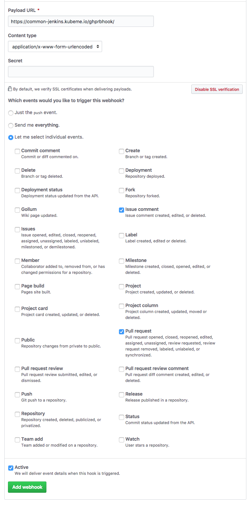

# Add Webhooks to Github

Within your repository, go to settings and add the following webhooks:

## Jenkins Webhooks

### Normal Webhook
* URL should be `jenkinsURL/github-webhook/` like `https://common-jenkins.kubeme.io/github-webhook/`
* Select `Send me everything`

### Additional Webhook

* URL should be `jenkinsURL/ghprbhook/` like `https://common-jenkins.kubeme.io/ghprbhook/`
* Select `Let me select indivdual events` and choose:
  * Issue comment
  * Pull Request

## Slack Webhooks
You can also add a webhook for slack, eg:
* URL should be like `https://hooks.slack.com/services/XXXXXXXXX/XXXXXXXXX/XXXXXXXXXXXXXXXXXXXXXXXX`
* Content Type should be: `Content Type: application/json`
* Select `Let me select individual events` and choose:
  * Commit comment
  * Delete
  * Deployment status
  * Issues
  * Pull request review
  * Push
  * Create
  * Fork
  * Issue Comment
  * Pull request
  * Pull request review comment
  * Release
