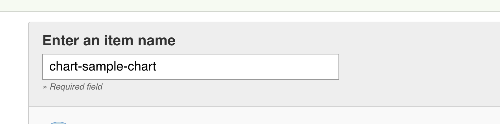
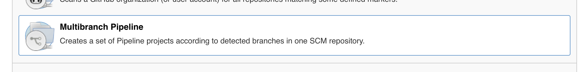
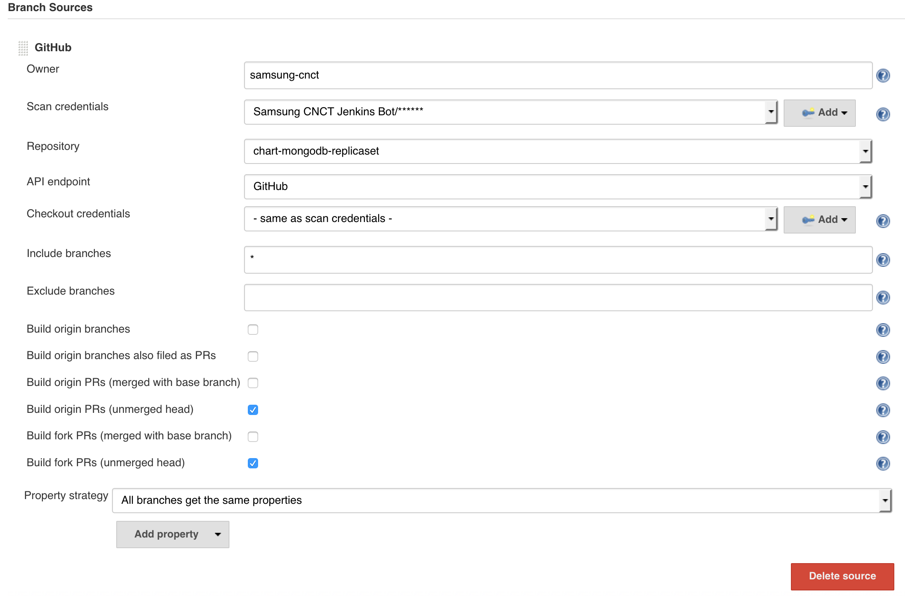
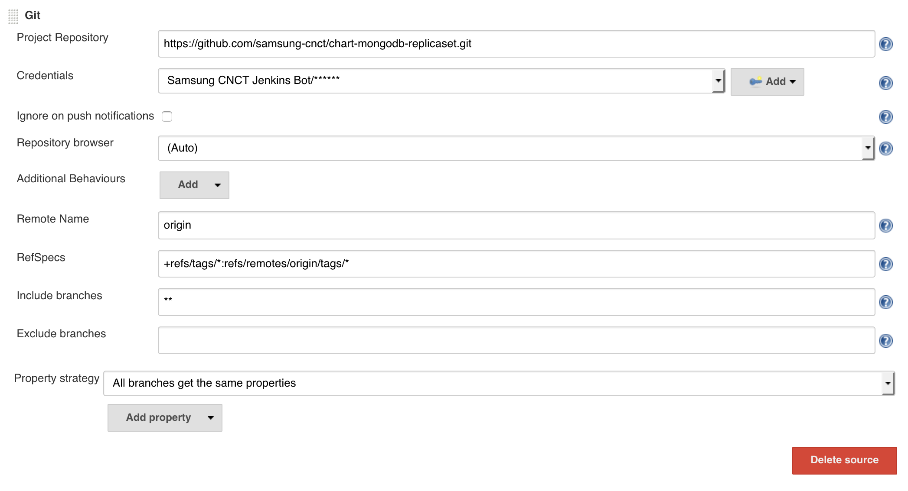
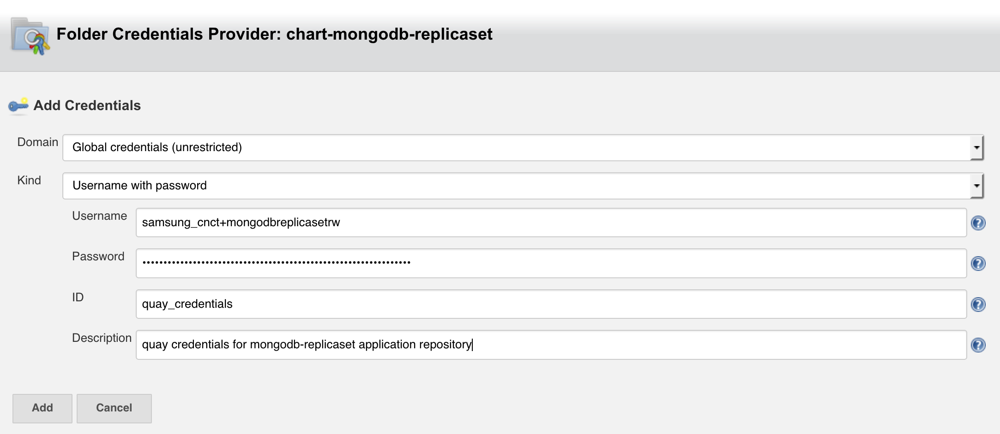

# Jenkins CI/CD Build and Deploy

Having cloned this repo to create a new chart using the [README](../README.md) 
instructions at, edit this Jenkinsfile and Chart.yaml.in.

### Jenkinsfile


#### Edit three definitions at the top:
```
def registry = "quay.io";
def registry_user = "samsung_cnct";
def chart_name = "sample-chart";
```

Replace each as needed. The chart_name should be the name of the chart you've added under the root of this git repo.

### Chart.yaml.in

Edit this file to match your chart as needed. Do not alter the line starting with `version:`.

## Configure Jenkins

### Login and create the project

* Log in to your Jenkins server.
* Create a new project by selecting `New Item` on the Jenkins Homepage
  * _Enter the name of this repo in the field at the top, eg chart-sample-chart_ 
  * Select Multibranch Pipeline 

### Add GitHub configuration
* Under `Branch Sources`, select `Add Source`
* Select Github
* _Set an owner, eg samsung-cnct_
* _Select an entry under "scan credentials", eg "Samsung CNCT Jenkins Bot/******"_
  * Using anonymous access to github may result in throttling
* _Select your repository, eg "chart-sample-chart"_
* Advanced
   * Check _Build origin PRs (unmerged head)_
   * Check _Build fork PRs (unmerged head)_
   * Uncheck _everything else_
* Add "Advanced clone behaviours"
   * _click Add_
   * Select "_Advanced Clone Behaviors_"
 	



### Add Git configuration
* Under `Branch Sources`, select `Add Source`
* Select Git
* _Add https url for the repo in "Project Repository", eg "https://github.com/samsung-cnct/chart-sample-chart.git"_
* _Add the same credentials as github above_
* Advanced
  * _Enter into RefSpecs_ `+refs/tags/*:refs/remotes/origin/tags/*`
  * _Enter into Include Branches_ `**`
* Build Configuration
  * _Enter into Script Path_ `build/Jenkinsfile`
  * Scan Repository Triggers
    * Periodically if not otherwise run



### Add quay.io application repository robot credentials

Easiest way to do this is to select an `Add` button on one of the source repositories `Credentials` lines

Per the Jenkinsfile, this credential should be set to `quay_credentials`

* Set the username to be the username of the robot - this is typically `group+robotname`
* Set the password to be the password of the robot - you can obtain this by reading the [quay instructions](quay.md)
* Set the ID to be `quay_credentials`



### You're almost done

So select `Save` and let's configure [github](github.md)

### NOTE NOTE NOTE

Chart builds for production require your use of _git tags_! Here are some things you need to know about tagging:

* from [Git document for tagging](https://git-scm.com/book/en/v2/Git-Basics-Tagging)..."Like most VCSs, Git has the ability to tag specific points in history as being important. Typically people use this functionality to mark release points (v1.0, and so on)."
* `git` tagging by default only tags a commit on your local repo. You must explicitly push your tags to your remote repos for your tags to persist remotely.
  * Set a local tag (_note_ that you tag a _commit_ as demonstrated here):
  ```
    # stuff is already added/staged
    $ git commit -m 'some message'
    $ git tag <tagname>
  ```
  * And then to push to remote:
  ```
    $ git push --tags
  ```
* If you tag a commit prematurely, you can delete it:
  * Local tags:
  ```
    $ git tag -d <tagname>
  ```
  * Remote tags:
  ```
    $ git push --delete origin <tagname>
  ```

