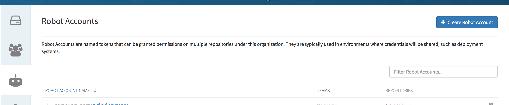
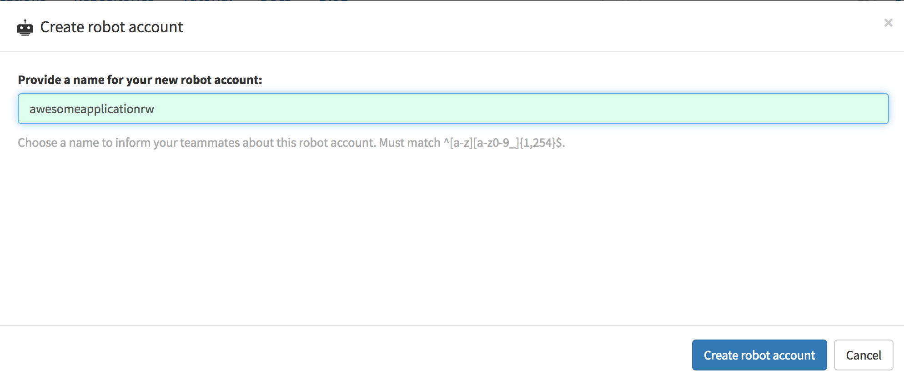
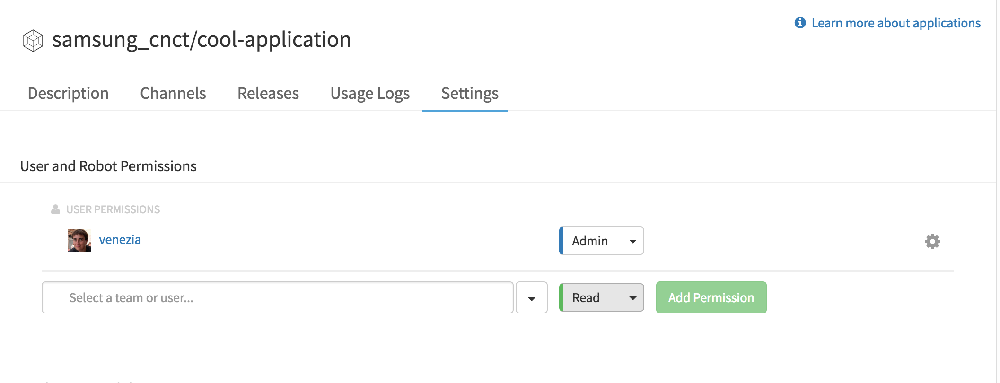
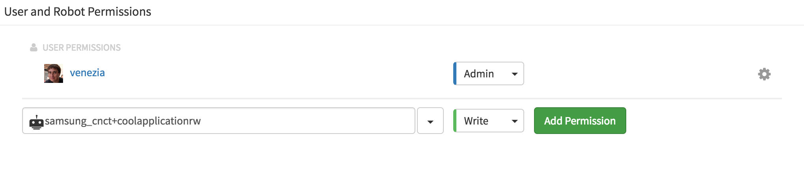
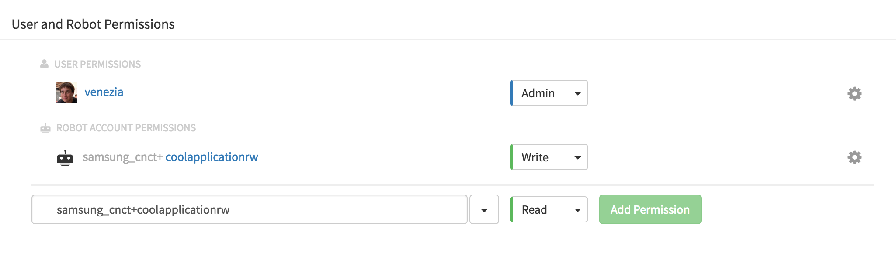

# Application Repositories in Quay
 
 Creating an application repository in quay will allow you to share helm charts
 with others.  This guide will show you how to create the repository and prepare 
 for a build server to take over
 
## Creating a repository in quay.io
 
 * Go to [quay.io](https://quay.io) and login if you are not yet logged in
 * Select the `+` sign near your name and select `New Repository` 
 * Select `Application Repository` and the group you want the application to be associated with. 
 * Adjust public or private as appropriate, and a helpful description will never hurt!
 * Create the repository by clicking `Create Public Repository` or `Create Private Repository`
 
## Creating a robot account in quay.io for coordination with your build server
 
 Its best to have a separate robot account per application that your CI/CD process uses.  Doing so
 * Improves auditing
 * Prevents mistakes (one build job accidently publishing to the wrong repository)
 
 To do so, please go to your the robots page for either your organization or your own account.  For example if my 
 organization is `awesome_inc`, then I would want to go to [awesome inc's robot page](https://quay.io/organization/awesome_inc?tab=robots)
 
 Once you are there:
 * Create a new robot account 
 * Give the robot a name - suggestion is name of repository + rw
   * `cool-application` becomes `coolapplicationrw`
   * `my-awesome-thing` becomes `myawesomethingrw` 

## Granting rights to application repository to the robot account

Now that you've created the robot account, you need to give it rights to the application.

* Go to your application repository's [setting page](https://quay.io/application/samsung_cnct/cool-application?tab=settings) 
* Type in your robot's name and select `write` access 
* Select `Add Permission` and verify that the robot was given permissions 

## Obtaining the robot's credentials

The last step is to determine the robot's password for use with your CI/CD process.  

To do that:
* Go to the robot list on your organization / personal settings or simply select the robot after 
you added it to the application's permissions
* Select `Robot Token` and copy the token.  This is the Robot's password 

If the robot's password is ever compromised, you can use this page to regenerate its password.  Please note you will 
have to update the CI/CD credentials with the updated password.

